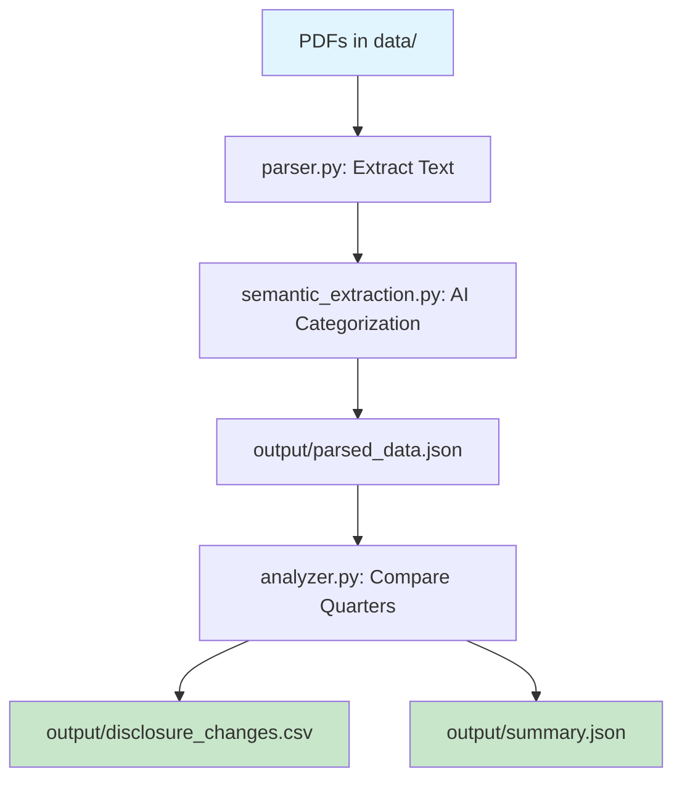

# Pipeline Architecture & Workflow

Complete explanation of the financial disclosure analysis pipeline, including all files, their responsibilities, and data flow.

---

## 📁 Project Structure

```
disclosure-analysis-pipeline/
├── data/                           # Input: Earnings call transcript PDFs
│   ├── AAPL_Q1_2024.pdf
│   └── AAPL_Q2_2024.pdf
├── output/                         # Output: Analysis results
│   ├── parsed_data.json           # Extracted & categorized content
│   ├── disclosure_changes.csv     # Detected changes (main output)
│   └── summary.json              # Statistics summary
├── src/
│   ├── pipeline.py               # 🎯 Main orchestrator
│   ├── parser.py                 # 📄 PDF text extraction
│   ├── semantic_extraction.py    # 🤖 AI-based section categorization
│   ├── analyzer.py               # 🔍 Quarter-to-quarter comparison
│   └── models.py                 # 📊 Data structure definitions
├── create_sample_data.py         # 🧪 Generate test data
├── .env                          # 🔑 API credentials
└── requirements.txt              # 📦 Dependencies
```

---

## 🔄 Complete Data Flow



---

## 📋 File-by-File Breakdown

### **1. `pipeline.py` - Main Orchestrator**

**Role:** Entry point that coordinates the entire workflow

**Key Functions:**
- `run_pipeline()` - Executes the 3-phase analysis
- `main()` - CLI argument parsing

**Workflow Steps:**

#### **Phase 1: PDF Parsing**
```python
parsed_data = parse_all_pdfs(
    data_dir="data",
    use_semantic_extraction=True  # Use AI for transcripts
)
# Returns: {company: {quarter: {section: text}}}
```

- Scans `data/` folder for PDFs
- Calls `parser.py` to extract text
- Calls `semantic_extraction.py` to categorize content
- Saves to `output/parsed_data.json`

#### **Phase 2: LLM Analysis**
```python
changes = analyze_all_companies(
    parsed_data,
    dry_run=False
)
# Returns: List of DisclosureChange objects
```

- Calls `analyzer.py` to compare consecutive quarters
- Uses Gemini to detect meaningful changes
- Returns structured change records

#### **Phase 3: Output Generation**
```python
save_to_csv(changes, "output/disclosure_changes.csv")
save_summary(changes, "output/summary.json")
```

**CLI Flags:**
```bash
--skip-parsing     # Skip Phase 1, use existing parsed_data.json
--dry-run          # Skip LLM calls, test logic only
--use-regex        # Use regex instead of AI (for SEC filings)
```

---

### **2. `parser.py` - PDF Text Extraction**

**Role:** Extract raw text from PDF files

**Key Functions:**

#### `DocumentParser` Class
```python
parser = DocumentParser(pdf_path)
full_text = parser.extract_text()
```

**What it does:**
- Uses `pdfplumber` to read PDF pages
- Extracts text page-by-page
- Handles errors gracefully

#### `parse_filename()`
```python
parse_filename("AAPL_Q1_2024.pdf")
# Returns: {"company": "AAPL", "quarter": "Q1_2024"}
```

**Parses filename to extract:**
- Company ticker
- Quarter and year

#### `parse_all_pdfs()`
```python
results = parse_all_pdfs(
    data_dir="data",
    use_semantic_extraction=True
)
```

**Two Modes:**

**Mode 1: Semantic Extraction (for Transcripts)**
```python
full_text = parser.extract_text()
sections = extract_semantic_sections(full_text, company, quarter)
# Uses AI to identify MD&A, Risk, Accounting content
```

**Mode 2: Regex Extraction (for SEC Filings)**
```python
sections = parser.parse()
# Uses predefined patterns to find sections
```

**Output Format:**
```json
{
  "AAPL": {
    "Q1_2024": {
      "MD&A": "Revenue grew 15%...",
      "Risk_Factors": "Supply chain risks...",
      "Accounting": "Depreciation policy..."
    },
    "Q2_2024": { ... }
  }
}
```

---

### **3. `semantic_extraction.py` - AI-Based Categorization**

**Role:** Use Gemini AI to intelligently identify and extract disclosure sections from unstructured earnings call transcripts

**Why Needed:**
- Transcripts are dialogue format (CEO, analysts talking)
- NO explicit section headers like "Item 2. MD&A"
- AI understands CONTEXT to categorize content

**Key Function:**

#### `extract_semantic_sections()`
```python
sections = extract_semantic_sections(
    full_text="CEO: Revenue grew 15%... CFO: We changed depreciation...",
    company="AAPL",
    quarter="Q1_2024"
)
```

**Process:**

1. **Creates AI Prompt:**
```python
prompt = f"""
Read this earnings call transcript and extract:

1. MD&A Content: Business performance, revenue, margins, strategy
2. Risk Factors: Risks, challenges, uncertainties mentioned
3. Accounting: Policy changes, estimates, methods

Transcript:
{full_text}

Return as JSON with 3 sections.
"""
```

2. **Calls Gemini API:**
```python
llm = ChatGoogleGenerativeAI(model="gemini-2.0-flash-lite")
response = llm.invoke(prompt)
```

3. **Parses JSON Response:**
```python
parsed = json.loads(response.content)
return {
    "MD&A": parsed["mda"],
    "Risk_Factors": parsed["risk_factors"],
    "Accounting": parsed["accounting"]
}
```

**Output Example:**
```json
{
  "MD&A": "CEO discussed Q1 revenue of $100B, up 12% YoY...",
  "Risk_Factors": "CEO mentioned supply chain challenges in Asia...",
  "Accounting": "CFO announced depreciation policy change from 4 to 5 years..."
}
```

---

### **4. `analyzer.py` - Quarter-to-Quarter Comparison**

**Role:** Use Gemini AI to detect meaningful changes between consecutive quarters

**Key Functions:**

#### `create_gemini_llm()`
```python
llm = create_gemini_llm(temperature=0.1)
```

Creates configured Gemini instance for analysis

#### `compare_sections()`
```python
changes = compare_sections(
    section_name="MD&A",
    text_previous="Revenue grew 15%...",  # Q1_2024
    text_current="Revenue moderated to 8%...",  # Q2_2024
    llm=llm
)
```

**Process:**

1. **Creates Comparison Prompt:**
```python
"""
Compare these two MD&A sections and identify:

PREVIOUS QUARTER:
Revenue grew 15% driven by strong iPhone demand...

CURRENT QUARTER:
Revenue moderated to 8% as demand softened...

Detect:
- Language shifts (strong → moderate)
- New specificity (vague → specific)
- Accounting changes

Return as JSON array of changes.
"""
```

2. **Calls Gemini:**
```python
response = llm.invoke(prompt)
```

3. **Parses JSON & Creates Objects:**
```python
changes = [
    DisclosureChange(
        section="MD&A",
        quote_old="Revenue grew 15%",
        quote_new="Revenue moderated to 8%",
        description_of_change="Revenue growth slowed significantly",
        signal_classification="Negative"
    )
]
```

#### `compare_quarters()`
```python
all_changes = compare_quarters(
    company="AAPL",
    quarter_current="Q2_2024",
    quarter_previous="Q1_2024",
    data_current={...},
    data_previous={...},
    llm=llm
)
```

**Compares all 3 sections:**
- MD&A changes
- Risk_Factors changes
- Accounting changes

Returns combined list of all detected changes

#### `analyze_all_companies()`
```python
results = analyze_all_companies(parsed_data, dry_run=False)
```

**Iterates over all companies:**
- Sorts quarters chronologically
- Compares consecutive pairs (Q1→Q2, Q2→Q3, etc.)
- Converts to CSV-ready format

---

### **5. `models.py` - Data Structure Definitions**

**Role:** Define Pydantic models for type safety and validation

**Key Models:**

#### `SignalClassification` (Enum)
```python
class SignalClassification(str, Enum):
    POSITIVE = "Positive"
    NEGATIVE = "Negative"
    NOISE = "Noise"
```

#### `DisclosureChange` (Main Output)
```python
class DisclosureChange(BaseModel):
    section: str                          # "MD&A", "Risk_Factors", "Accounting"
    quote_old: str                        # Verbatim from Q1
    quote_new: str                        # Verbatim from Q2
    description_of_change: str            # One-sentence summary
    signal_classification: SignalClassification  # Positive/Negative/Noise
```

**Example:**
```python
change = DisclosureChange(
    section="MD&A",
    quote_old="temporary supply chain challenges",
    quote_new="structural supply chain constraints",
    description_of_change="Language shifted from temporary to structural challenges",
    signal_classification=SignalClassification.NEGATIVE
)
```

#### `SectionComparison`
```python
class SectionComparison(BaseModel):
    changes: List[DisclosureChange]
```

Used to group all changes found in a section

---

### **6. `create_sample_data.py` - Test Data Generator**

**Role:** Create fake earnings call data for testing WITHOUT needing PDFs or API calls

**What it does:**
```python
sample_data = {
    "AAPL": {
        "Q1_2024": {
            "MD&A": "CEO: Revenue grew 15% to $100B...",
            "Risk_Factors": "CEO: Intense competition...",
            "Accounting": "CFO: Depreciation 4 years..."
        },
        "Q2_2024": {
            "MD&A": "CEO: Revenue moderated to 8%...",  # Changed!
            "Risk_Factors": "CEO: Competition intensified...",  # Changed!
            "Accounting": "CFO: Depreciation 5 years..."  # Changed!
        }
    }
}

# Save to output/parsed_data.json
save_parsed_data(sample_data, "output/parsed_data.json")
```

**Pre-built changes:**
- Language shifts: "robust" → "moderated"
- Specificity: "temporary" → "structural"
- Accounting: Depreciation 4→5 years

**Usage:**
```bash
python3 create_sample_data.py
python3 -m src.pipeline --skip-parsing
# Tests comparison logic without PDF parsing
```

---

## 🎬 Complete Workflow Example

### **Scenario: Analyze Apple Q1 and Q2 2024 Earnings Calls**

#### **Step 1: Prepare Input**
```
data/
├── AAPL_Q1_2024.pdf  (Earnings call transcript)
└── AAPL_Q2_2024.pdf  (Earnings call transcript)
```

#### **Step 2: Run Pipeline**
```bash
python3 -m src.pipeline
```

#### **Step 3: Internal Flow**

**Phase 1A: Text Extraction** (`parser.py`)
```python
# For AAPL_Q1_2024.pdf
parser = DocumentParser("data/AAPL_Q1_2024.pdf")
q1_text = parser.extract_text()
# Returns: "CEO: Thank you for joining... CFO: Revenue was..."
```

**Phase 1B: Semantic Categorization** (`semantic_extraction.py`)
```python
q1_sections = extract_semantic_sections(q1_text, "AAPL", "Q1_2024")
# Gemini AI reads dialogue and categorizes:
# Returns: {
#   "MD&A": "Revenue discussion...",
#   "Risk_Factors": "Competition mentions...",
#   "Accounting": "Policy changes..."
# }
```

**Same for Q2_2024.pdf...**

**Phase 1C: Save Parsed Data**
```json
// output/parsed_data.json
{
  "AAPL": {
    "Q1_2024": {"MD&A": "...", "Risk_Factors": "...", "Accounting": "..."},
    "Q2_2024": {"MD&A": "...", "Risk_Factors": "...", "Accounting": "..."}
  }
}
```

**Phase 2: Comparison** (`analyzer.py`)
```python
# Compare Q1 → Q2 for each section
mda_changes = compare_sections(
    section_name="MD&A",
    text_previous=q1_sections["MD&A"],
    text_current=q2_sections["MD&A"],
    llm=gemini_llm
)
# Detects: "strong growth" → "moderated growth" (Negative)

risk_changes = compare_sections(...)
# Detects: "temporary challenges" → "structural issues" (Negative)

accounting_changes = compare_sections(...)
# Detects: Depreciation 4 years → 5 years (Accounting change)
```

**Phase 3: Output Files**

**`output/disclosure_changes.csv`**
```csv
Company,Quarter_Previous,Quarter_Current,Section,Quote_Old,Quote_New,Description,Signal
AAPL,Q1_2024,Q2_2024,MD&A,"strong growth","moderated growth","Revenue growth language weakened",Negative
AAPL,Q1_2024,Q2_2024,Risk_Factors,"temporary challenges","structural issues","Risk language intensified",Negative
AAPL,Q1_2024,Q2_2024,Accounting,"4 years","5 years","Depreciation useful life extended",Noise
```

**`output/summary.json`**
```json
{
  "total_changes": 3,
  "by_signal": {
    "Positive": 0,
    "Negative": 2,
    "Noise": 1
  },
  "by_section": {
    "MD&A": 1,
    "Risk_Factors": 1,
    "Accounting": 1
  }
}
```

---

## 🔑 Key Concepts

### **Why Two AI Steps?**

1. **Semantic Extraction** (`semantic_extraction.py`)
   - **Task:** Categorize unstructured transcript into sections
   - **Input:** Raw dialogue ("CEO: Revenue grew...")
   - **Output:** Structured sections (MD&A, Risk, Accounting)
   - **Why:** Transcripts have NO explicit section headers

2. **Change Detection** (`analyzer.py`)
   - **Task:** Compare same sections across quarters
   - **Input:** Q1 MD&A vs Q2 MD&A
   - **Output:** Detected changes with sentiment
   - **Why:** Humans can't spot subtle language shifts at scale

### **Sample Data vs Real Data**

| Aspect | Sample Data | Real Data |
|--------|-------------|-----------|
| **Source** | `create_sample_data.py` | PDFs in `data/` |
| **Parsing** | Skip (`--skip-parsing`) | Full pipeline |
| **AI Usage** | Comparison only | Extraction + Comparison |
| **Cost** | 1 LLM call | 2 LLM calls per quarter |

### **Cost Breakdown (Typical Analysis)**

**For 2 companies × 4 quarters each:**
- Semantic Extraction: 8 calls (1 per quarter)
- Comparison: 6 calls (Q1→Q2, Q2→Q3, Q3→Q4 for 2 companies)
- **Total:** ~14 LLM calls (~$0.50 on free tier)

---

## 🚀 Quick Reference Commands

```bash
# Test with sample data (no PDFs needed)
python3 create_sample_data.py
python3 -m src.pipeline --skip-parsing

# Full analysis with real PDFs
python3 -m src.pipeline

# Test logic without API calls
python3 -m src.pipeline --dry-run

# Use regex for SEC filings (not transcripts)
python3 -m src.pipeline --use-regex
```

---

## 📊 Output Files Explained

### **`parsed_data.json`** - Intermediate Data
```json
{
  "AAPL": {
    "Q1_2024": {
      "MD&A": "Extracted business discussion...",
      "Risk_Factors": "Extracted risk content...",
      "Accounting": "Extracted accounting changes..."
    }
  }
}
```
**Use:** Reuse for multiple analyses without re-parsing PDFs

### **`disclosure_changes.csv`** - Main Output
```csv
Company,Quarter_Previous,Quarter_Current,Section,Quote_Old,Quote_New,Description,Signal
```
**Use:** Import to Excel/databases for analysis

### **`summary.json`** - Statistics
```json
{
  "total_changes": 15,
  "by_signal": {"Positive": 3, "Negative": 8, "Noise": 4},
  "by_section": {"MD&A": 5, "Risk_Factors": 7, "Accounting": 3}
}
```
**Use:** High-level dashboard metrics

---

## 🎯 Summary

| File | When It Runs | Purpose | AI Required? |
|------|--------------|---------|--------------|
| `pipeline.py` | Always | Orchestrate workflow | No |
| `parser.py` | When parsing PDFs | Extract text | No |
| `semantic_extraction.py` | When parsing transcripts | Categorize content | ✅ Yes |
| `analyzer.py` | When comparing | Detect changes | ✅ Yes |
| `models.py` | Always | Data validation | No |
| `create_sample_data.py` | Manual testing | Generate test data | No |

**Total AI Calls per Quarter:** 2 (Extraction + Comparison)  
**Total Cost (4 quarters):** ~$0.50 USD (free tier)
